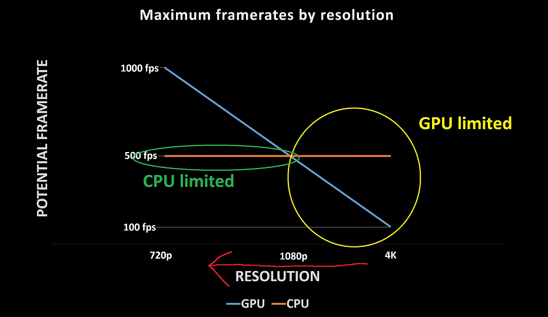
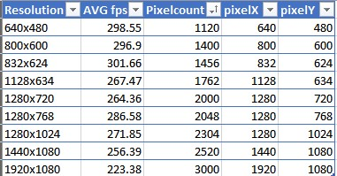
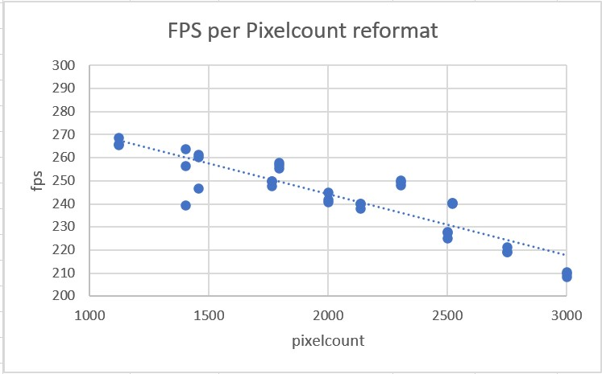
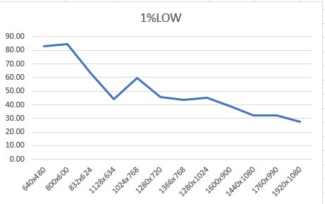
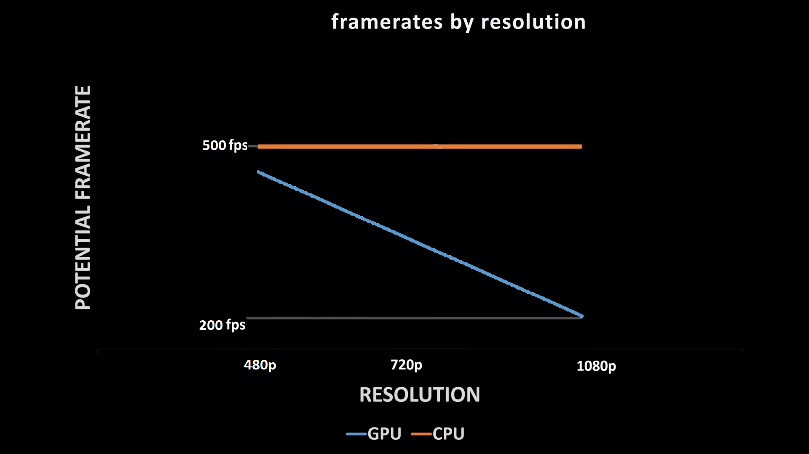

# testing 3kliks bottleneck theory
Heb wat zitten testen om te zoeken welk deel van mijn computer het meeste nood heeft aan vervanging (behalve mijn monitor lol).
Idee is dus vooral om te zien of mijn FPS gelimiteerd wordt door mijn GPU of mijn CPU. 3kliksphilip heeft hier een makkelijke video over om snel uit te leggen hoe het werkt (3kliks, 2022(a)). https://www.youtube.com/watch?v=1n5hh0NDn-g

en een langere over bottlenecks en fps in csgo in het algemeen (voor high performance pc's): https://www.youtube.com/watch?v=5GneP6MuVOk (3kliks, 2022(b)). 

## de theorie
Belangrijkste is eigenlijk deze afweging. CPU geeft u een absoluut plafond voor FPS dat in theorie onafhankelijk is van resolutie. Van de GPU is er een inverse relatie tussen FPS en het aantal pixels dat hij moet renderen (pixelcount). Kort door de bocht is dit ook zo voor andere graphics settings: GPU moet werken voor alles wat gerenderd moet worden, maar de CPU werkt eigenlijk even hard per frame, ongeacht de inhoud (*eigenlijk niet heus maar om het s1mple te houden*).

Dit betekend dus dat, in een experiment waar je je FPS meet met een steeds lagere resolutie, je eerst je FPS zou zien stijgen met elke keer dat je resolutie daalt. Dan, wanneer je je FPS plafond van de CPU hit, stopt je FPS met stijgen. Op de figuur is dit het punt waar de blauwe en oranje lijn elkaar kruisen.

In theorie is dit het punt waar je voor u combinatie van GPU, CPU en settings je resolutie moet kiezen, een goed equilibrium. Er is hier geen "*bottleneck*" die de performance van een van je componenten ongebruikt laat.

Dit was mijn eerste bruikbare data (dacht ik)

Een ding dat ik er al uit leerde is dat (*voor mijn settings, componenten en resolutie*) het verschil tussen fullscreen en fullscreen windowed geen impact heeft op FPS. Hier zag ik vroeger een afweging tussen een klein beetje minder FPS, maar veel makkelijker switchen tussen windows en dat alt+tabben veel minder erg is. In de realiteit **voelt** het nog smoother, maar kan perfect ook placebo zijn. Het zou ook kunnen dat er iets gebeurt in fullscreen (op het driverniveau, iets gsync-achtig?) dat niet gebeurt in windowed. Verschil is niet merkbaar in comp games in ieder geval.

Hetzelfde geldt eigenlijk voor de native resolutie (de resolutie waar mijn display staat ingesteld in windows settings). Ik ging er altijd vanuit dat er een extra laag aan *"berekening"* moest gebeuren wanneer mijn game-resolutie en windows-resolutie niet gelijk waren, die een dip in FPS zou geven.

## off the rails
oke hier keek ik dus effectief naar mijn data in grafiek vorm, en zag dat er waarschijnlijk een meetfout gebeurt was op de resoluties 720p en 1128x634 (F tier resolutie btw)
               

Hier begon mijn tocht naar betere data. Het zou veel te lang duren om uit te leggen wat er allemaal beter aan is, maar er is meer, beter getimed, beter gecalibreerd, en toch met een enkel paar meetfouten (zie excel file [HIER](BOTTLENECK.xlsx), waarschijnlijk door windows update). Het is wel goed dat ik deze gedaan heb, want mijn resultaten zijn compleet anders.

## resultaten

Hier zijn de echte resultaten dus, eigenlijk vrij saai. Je ziet gewoon dat hogere resolutie -> lagere framerate. De CPU bottleneck blijft schijnbaar uit. Je ziet dit nog het beste als je de framerates plot volgens pixelcount:

Hetzelfde zien we ook bij de 1% low frames. Dit is eigenlijk een best belangrijke metric omdat het eigenlijk aangeeft hoe hard je stutters zult ervaren, als je 1% lows rond de 90 fps zitten voel je meestal niets. Natuurlijk heb je dan echt een beast gpu nodig (of speel je op 440p lol).

Al bij al is het dus duidelijk dat ik mijn CPU limiet niet bereik. Mijn arme rx580 is dus de bottleneck. Niets om verbaasd te zijn.

---

## conclusie
We leerden dat ik mij geen zorgen moet maken over de fullscreen of windowed optie, aangezien blijkt dat er geen impact is op de fps, het is gewoon een optie van voelen en zien of ik de aangevoelde smoothness van fullscreen effectief belangrijker vind dan snel kunnen switchen tussen andere windows. Hetzelfde geldt voor de set resolutie in windows settings.

In praktijk zien we dus dat dit equilibrium-punt enkel handig is voor computers die een belachelijk beefed up GPU hebben tegenover de CPU, of gewoon in de top performance tier zitten overall. Ik moet waarschijnlijk gewoon mijn geld sparen voor een monitor, of een cadeautje voor mijn mama. 

Met andere woorden: voor mij ziet de grafiek er zo uit:

:(

Meer onderzoek nodig heeft iemand een rx590 pls?

Danku om te luisteren naar mijn presentatie :)

### Sources
        3kliks, P. 2022(a), CPU vs GPU Bottleneck Explained in 60 seconds #shorts, https://www.youtube.com/watch?v=1n5hh0NDn-g

        3kliks, P. 2022(b), 1000 FPS in CS:GO????, https://www.youtube.com/watch?v=5GneP6MuVOk